<div align="center">



<a href="https://github.com/adriennie">

</a>

<br/>

<a href="https://linkedin.com/in/adrikapradhan"></a>
<a href="mailto:adrika.pradhan@usi.ch"></a>


</div>

## 🍂 &nbsp;Hello, world

I'm an AI engineer in the making, currently in **Lugano**, between the Alps and a lake, doing an MSc in AI. I like the part of ML where the maths meets production: evaluation harnesses, retrieval pipelines, geospatial backends, and anything that has to keep working after the demo ends.

> *I like the gap between "it works in my notebook" and "it works on a Monday morning."*

📍 **Based in** Lugano, Switzerland 🇨🇭  
🎓 **Studying** MSc Artificial Intelligence @ USI  
🔎 **Into** evals, RAG, numerical methods, system design  
🤝 **Open to** internships, industry theses, research collabs

<div align="center"></div>

## 🍁 &nbsp;This semester

<table>
<tr>
<td align="center" width="25%">🧠<br/><b>Engineering AI Systems</b><br/><sub>designing ML that survives production</sub></td>
<td align="center" width="25%">🎨<br/><b>UX Design</b><br/><sub>AI is only useful if people can use it</sub></td>
<td align="center" width="25%">📐<br/><b>Numerical Algorithms</b><br/><sub>iterative solvers, convergence, conditioning</sub></td>
<td align="center" width="25%">🇩🇪<br/><b>German</b><br/><sub>A1 → B1, one conjugation at a time</sub></td>
</tr>
</table>

<div align="center"></div>

## 🌰 &nbsp;Things I've built


## 🔭 &nbsp;Research: cleaning up the night sky

Convolutional autoencoder denoising plus YOLO-inspired detection of faint objects in astronomical images (**DeepSpaceYOLO** dataset).

<div align="center">


</div>

<div align="center"></div>

## 🧺 &nbsp;Toolbox

<div align="center">

**Languages**<br/>


<br/><br/>

**ML & Numerics**<br/>


<br/><br/>

**LLM & GenAI**<br/>


<br/><br/>

**Data, Infra & Dev Tools**<br/>


</div>

<div align="center"></div>

## 🍵 &nbsp;How I work

```text
1. Reproduce before improving   →  if I can't match the baseline, I don't trust my idea
2. Evaluate before shipping     →  a model without a metric is an opinion
3. Treat data as the system     →  leakage and bad splits break more than bad architectures
4. Write down what failed       →  negative results belong in the README too
```

<div align="center"></div>

## 📈 &nbsp;Activity

<div align="center">


<br/><br/>


</div>

## 🤝 &nbsp;Let's talk

Working on something where the model is only half the problem? I'm looking for **AI + X** internships, industry-collaborative theses and research projects in 🇨🇭 / DACH. Reach me on [LinkedIn](https://linkedin.com/in/adrikapradhan) or at **adrika.pradhan@usi.ch**.


