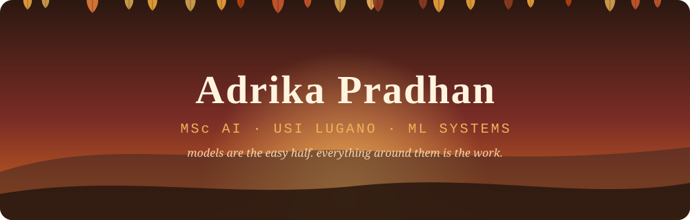

<div align="center">



<a href="https://github.com/adriennie">

</a>

<br/>

<a href="https://www.linkedin.com/in/adrika-pradhan-3a92622ba/"></a>
<a href="mailto:adrika.pradhan@usi.ch"></a>


</div>

## 🍂 &nbsp;Hello, world

I'm an MSc AI student at **USI Lugano**, drawn to the part of ML where the maths meets production: benchmarks, evaluation, retrieval, observability, and anything that has to keep working after the demo ends.

> *The gap between "it works in my notebook" and "it works on a Monday morning" is where most of the interesting problems live.*

<table>
<tr>
<td width="50%" valign="top">

📍 **Based in** Lugano, Switzerland<br/>
🎓 **Studying** MSc Artificial Intelligence @ USI<br/>
🏫 **Before** B.Tech CS (AI & ML), UPES

</td>
<td width="50%" valign="top">

🌍 **Speaks** English, German (A1 and climbing)<br/>
🔎 **Into** LLM inference, evaluation, log analysis, numerical methods<br/>
🏅 **Certified** Azure AI Engineer Associate (AI-102)

</td>
</tr>
</table>

<div align="center"></div>

## 🍁 &nbsp;What I care about

<table>
<tr>
<td align="center" width="33%" valign="top">

### 🔬 Measure

Reproducible benchmarks, ablations with more than one seed, and write-ups that state what the numbers *don't* show.

</td>
<td align="center" width="33%" valign="top">

### ⚙️ Serve

Getting models out of notebooks: LLM inference and fine-tuning, APIs, containers, CI that actually runs.

</td>
<td align="center" width="33%" valign="top">

### 🔭 Observe

Logs, traces and telemetry, and anomaly detection that stays honest about its recall.

</td>
</tr>
</table>

<div align="center"></div>

## 🧺 &nbsp;Toolbox

<div align="center">

**Languages**<br/>


<br/><br/>

**ML & Numerics**<br/>


<br/><br/>

**LLMs & GenAI**<br/>


<br/><br/>

**Systems, Data & Observability**<br/>


</div>

<div align="center"></div>

## 🎖️ &nbsp;Certifications & recognition

<div align="center">


</div>

<div align="center"></div>

## 🍵 &nbsp;How I work

```text
1. Reproduce before improving   →  if I can't match the baseline, I don't trust my idea
2. Evaluate before shipping     →  a model without a metric is an opinion
3. Treat data as the system     →  leakage and bad splits break more than bad architectures
4. State the limits             →  every README says what the numbers don't show
5. Write down what failed       →  negative results belong in the repo too
```

<div align="center"></div>

## 📈 &nbsp;Activity

<div align="center">


</div>

<div align="center"></div>

## 🍂 &nbsp;Say hello

If you're building something where the model is only half the problem (evaluation, serving, data, observability), I'm always happy to talk shop. Find me on [LinkedIn](https://www.linkedin.com/in/adrika-pradhan-3a92622ba/) or at **adrika.pradhan@usi.ch**.


